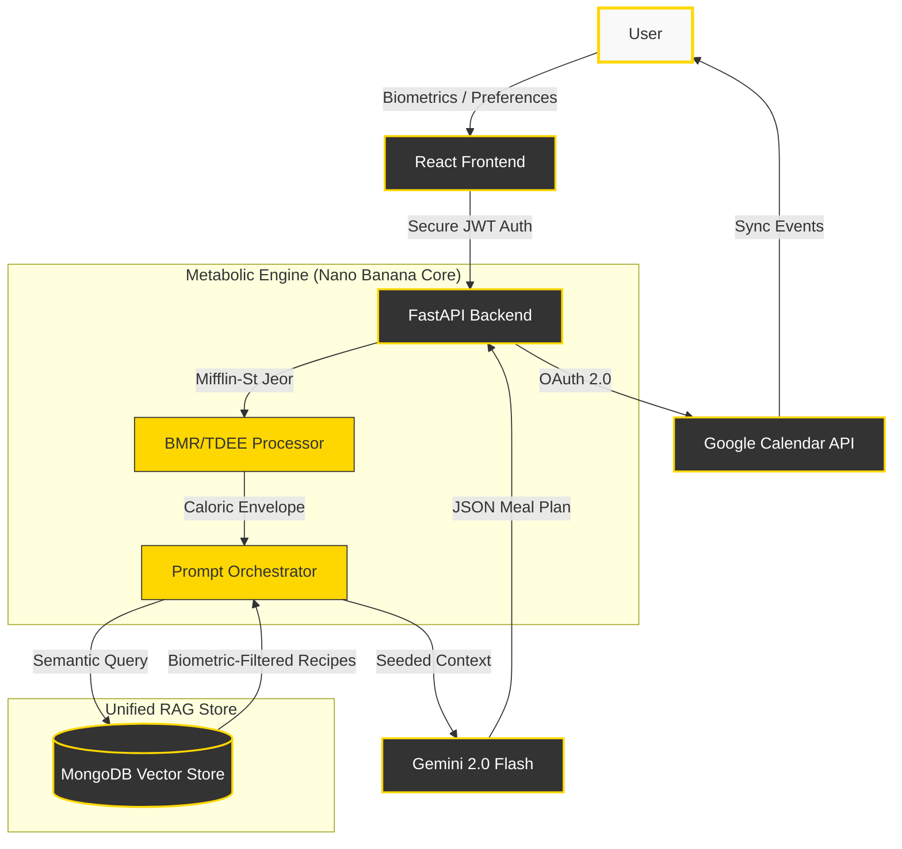

# FitFork: AI-Powered Metabolic Culinary Intelligence 🥗

[](#)
[](LICENSE)
[](https://fastapi.tiangolo.com/)
[](https://react.dev/)
[](https://aistudio.google.com/)

**FitFork** is a next-generation, RAG-powered culinary assistant designed to bridge the gap between metabolic requirements and professional recipe execution. It transforms complex user metrics into actionable, dietary-compliant meal plans using state-of-the-art vector retrieval and large language models.

---

## 📚 Documentation

For a deep dive into how FitFork works and how to set it up, please refer to our detailed guides:

- [🏗️ **Architecture & RAG Pipeline**](docs/architecture.md)
- [🚀 **Detailed API Reference**](docs/api.md)
- [⚙️ **Setup & Installation**](docs/setup.md)

---

---

## � The Vision: Metabolic Intelligence

Traditional meal planners rely on rigid templates. **FitFork** treats nutrition as a dynamic data problem. By analyzing height, weight, activity levels, and fitness goals (Mifflin-St Jeor accuracy), the system generates a unique caloric and macronutrient fingerprint for every user.

---

## 🎨 UI & Aesthetics: Deep Olive & Cream

FitFork features a **premium dark botanical aesthetic**. Designed for the modern kitchen, the high-contrast "Deep Olive & Cream" palette ensures readability in low-light environments while maintaining a grounded, sophisticated feel.

<p align="center">
  
  
</p>
<p align="center">
  
  
</p>

---

---

## 🏗️ System Architecture

Our solution is built on a high-concurrency, biometric-aware architecture that unifies nutrition science with modern retrieval-augmented generation in a high-contrast **Nano Banana** aesthetic.



---

### **Backend (Metabolic Engine)**

- **FastAPI**: Asynchronous, high-performance API layer.
- **MongoDB**: Unified store for recipes, user profiles, authentication, and chat history.
- **Google GenAI SDK**: Native interface for Gemini 2.5 models.
- **Pydantic**: Strict data validation for complex nutritional schemas.

### **Frontend (Culinary Experience)**

- **Vite + React**: Modern, lightning-fast rendering engine.
- **Shadcn UI**: For premium, accessible component architecture.
- **Framer Motion**: Subtle micro-animations for an alive, interactive interface.
- **Tailwind CSS**: Custom botanical tokens for a unified design system.

---

## ⚙️ Development Guide

### Prerequisites

- Python 3.10+
- Node.js 18+
- MongoDB instance (Local or Atlas)
- API Keys: OpenRouter, Scaledown (Optional)

### Backend Initialization

```bash
cd backend
python -m venv venv
source venv/bin/activate  # On Windows: .\venv\Scripts\activate
pip install -r requirements.txt
cp .env.example .env      # Configure your environment variables
uvicorn app.main:app --reload
```

### Frontend Initialization

```bash
cd frontend
npm install
npm run dev
```

---

## � API Overview (Summary)

| Endpoint          | Method | Purpose                                        |
| :---------------- | :----- | :--------------------------------------------- |
| `/auth/signup`    | POST   | Resident registration with hashed credentials. |
| `/user/nutrition` | POST   | Calculate BMR/TDEE and persist profile.        |
| `/search`         | POST   | Personalized RAG recipe retrieval.             |
| `/meal-plan`      | POST   | Generate full interactive calendar plan.       |
| `/health`         | GET    | System integrity check.                        |

---

## 🗺️ Roadmap

- [ ] **Phase 4**: In-app Grocery List generator based on weekly recipes.
- [ ] **Phase 5**: Real-time pantry tracking via image recognition.
- [ ] **Phase 6**: Integration with wearable health data (Apple Health/Google Fit).

---

## 📄 License

This project is licensed under the MIT License - see the [LICENSE](LICENSE) file for details.

---

**FitFork** is built to empower individuals to take control of their nutrition without sacrificing the joy of professional-grade cooking. 🌿🍔
