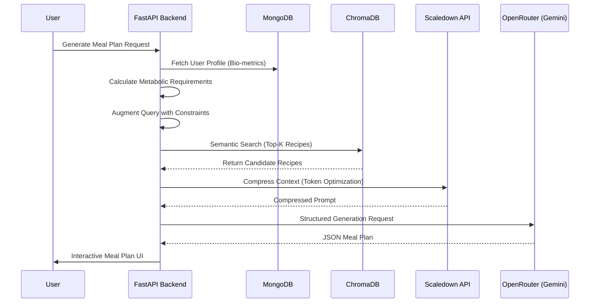

# Architecture Overview: FitFork 🥗

FitFork is built with a modern, decoupled architecture focusing on metabolic precision and high-performance recipe retrieval.

## System Components

### 1. Frontend (The Culinary Interface)

- **Framework**: React 18 with Vite.
- **Styling**: Tailwind CSS with a custom "Deep Olive & Cream" botanical design system.
- **UI Components**: Shadcn UI for accessible, premium components.
- **State Management**: React Context (AuthContext) for user sessions.
- **Animations**: Framer Motion for smooth transitions and interactive micro-animations.

### 2. Backend (The Metabolic Engine)

- **Framework**: FastAPI (Asynchronous Python).
- **Authentication**: JWT-based OAuth2 with password hashing (bcrypt).
- **Nutritional Logic**: Implements the Mifflin-St Jeor equation to calculate BMR and TDEE based on user profile metrics (height, weight, age, activity).

### 3. Data Layer

- **NoSQL Database**: MongoDB for user profiles, meal plan persistence, and session data.
- **Vector Database**: ChromaDB for semantic search of the recipe corpus.

## AI Implementation: RAG Pipeline

The core of FitFork is its **Retrieval-Augmented Generation (RAG)** pipeline, which ensures meal plans are grounded in actual high-quality recipes.

### Context Compression (Scaledown)

To minimize latency and token costs while maintaining recipe integrity, FitFork uses **Scaledown** technology. This compresses the retrieved recipe metadata into a concentrated context window before sending it to the LLM.

### LLM Gateway (OpenRouter)

We utilize `google/gemini-2.0-flash-001` via OpenRouter. This model provides the perfect balance of speed and complex reasoning required for balancing nutritional macros across a 7-day calendar.
